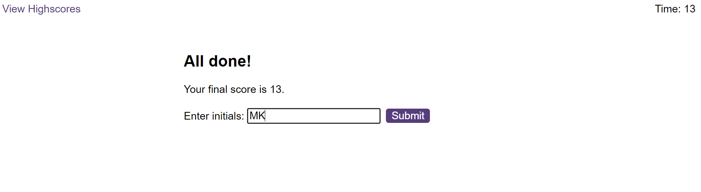

# Code Quiz

## Description

This is a code for a [Code Quiz](https://maijako.github.io/code-quiz).

It features a simple responsive design, different screens and interactive buttons that trigger quiz start, displaying the questions and instant feedback:

There is also an opportunity to enter player initials in order for their score to be stored in the local storage:

Final scores can be viewed until cleared, and are stored in the descending order:

## Usage

The app can be used to test beginner developer knowledge of JavaScript, and the code can be re-used to generate simple quizzes on any subject, by updating the questions content in the questions.js file. 

## Credits

The source code and the original asset files were provided by [Trilogy Education](https://2u.com/) as part of the Front End Web Development bootcamp sponsored by the [Skills For Life](https://skillsforlife.edx.org/) program.

## Licence

This code uses MIT License.

